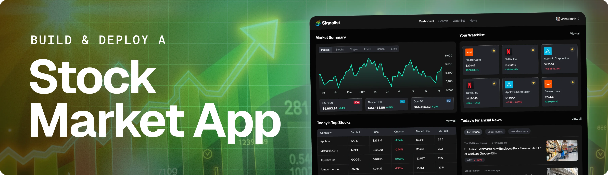

<div align="center">
  <br />
  
  <br />


  <h3 align="center">Stock Market App — Alerts, Charts, AI Insights</h3>
</div>

---

## 📋 Table of Contents

1. ✨ [Introduction](#introduction)
2. ⚙️ [Tech Stack](#tech-stack)
3. 🔋 [Features](#features)
4. 🤸 [Quick Start](#quick-start)

---

## ✨ Introduction

AI-powered modern stock market app built with Next.js, Shadcn, Better Auth, and Inngest.  
It lets users track real-time prices, set personalized alerts, explore company insights, and manage watchlists.  
The admin dashboard allows managing stocks, publishing news, and monitoring user activity, while event-driven workflows power automated alerts, AI-driven daily digests, earnings notifications, and sentiment analysis.

---

## ⚙️ Tech Stack

- **Next.js** – Full-stack React framework providing server-side rendering, static site generation, and API routes.
- **TypeScript** – Adds type safety and improves maintainability.
- **TailwindCSS** – Utility-first CSS framework for fast and responsive styling.
- **Shadcn/UI** – Accessible and customizable UI component library.
- **Better Auth** – Framework-agnostic authentication & authorization for email/password and social logins.
- **MongoDB** – NoSQL database for flexible and scalable data storage.
- **Inngest** – Event-driven workflow and background job system for automated processes.
- **CodeRabbit** – AI-assisted code review integration for better code quality.
- **Nodemailer** – Handles transactional and alert email notifications.
- **Finnhub API** – Provides real-time stock, forex, and crypto market data.

---

## 🔋 Features

- **Stock Dashboard:** Real-time stock tracking with interactive charts and historical data.
- **Search & Filters:** Quickly find stocks by name, industry, or performance.
- **Watchlist & Alerts:** Personalized watchlists and configurable alert thresholds.
- **Company Insights:** View financial metrics, news, and sentiment analysis.
- **Automated Workflows:** Event-driven processes (via Inngest) for real-time updates, alerts, and reports.
- **AI-Powered Insights:** Personalized daily summaries and earnings notifications.
- **Email Notifications:** Automated emails for price alerts and updates.
- **Admin Dashboard:** Manage stocks, users, and analytics efficiently.

---

## 🤸 Quick Start

**Prerequisites**
- [Git](https://git-scm.com/)
- [Node.js](https://nodejs.org/en)
- [npm](https://www.npmjs.com/)

**Clone the Repository**
```bash
git clone https://github.com/adrianhajdin/signalist_stock-tracker-app.git
cd signalist_stock-tracker-app
